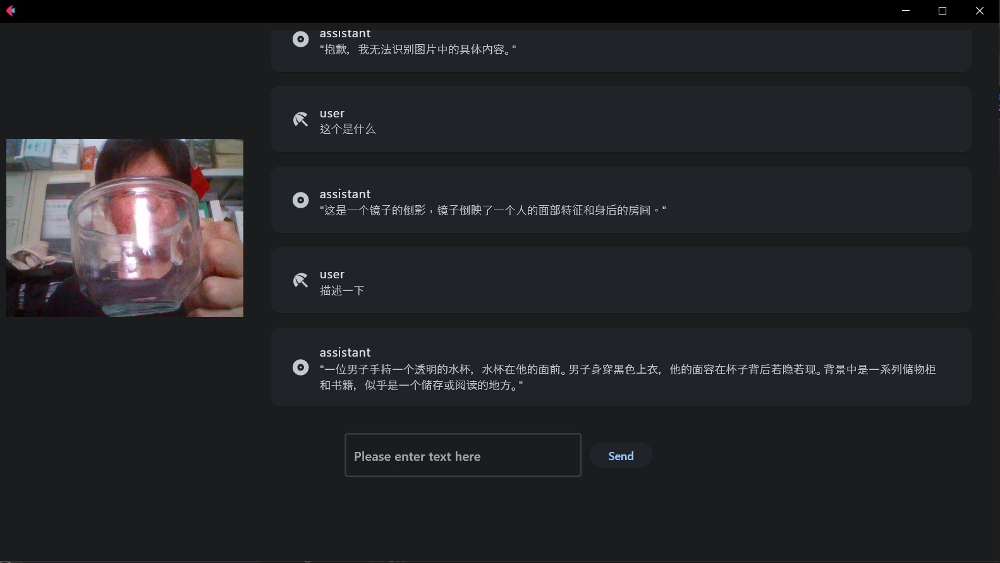

# videoChatWithLLM

##### 视频对话与llm

通过摄像头采集实时画面，在人物对话时截取最后一帧与人物语言合成prompt发给大模型

采用模型：internlm-xcomposer2-vl-7b

Real time images are captured through cameras, and the last frame is captured during character dialogue, combined with character language to synthesize a prompt and send it to the large model

Using model: internlm xcomposer2-vl-7b

# Todo
· 优化视频对话流程

· 加入记忆功能

· 实现表情功能，具象化LLM

· 模型微调，降低模型功耗，加速模型生成速度

· 实在不行就炼一个新的视频生成模型（看好sora）

# Todo

·Implement ASR and TTS functions

·Implement facial expression function and concretize LLM

·Model fine-tuning to reduce model power consumption and accelerate model generation speed

·If it really doesn't work, then refine a new video generation model (optimistic about Sora)

[video](https://iaspooaf477.feishu.cn/docx/Ms8mdjrVzoLiFExZzAmcZmnMn9g?from=from_copylink)

